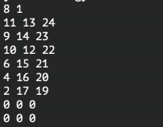

## 第2回全国統一プログラミング王決定戦予選参加記
[日経コン予選](https://atcoder.jp/contests/nikkei2019-2-qual)参加しました〜.  
コンテスト成績は[こちら](https://atcoder.jp/users/jj1guj/history/share/nikkei2019-2-qual)  
まあ、爆死しました.  
A問題のみの1完でした.  
A問題は最初しらみつぶしにループかけて行けばいけるやろって思いながら実装している途中で2で割ればいいことに気づき、AC.  
Aを解き終わってからBを読んでみたらなんか「木」とかいうワードが出てきてちょっと嫌な予感がしたので他の問題をのぞきに行くことに.  
まあ、どれも難しそうだったのですが、その中でもDとEがいけそうな気がし、Eが[この前のABCで見たような問題(ABC143 D)](https://atcoder.jp/contests/abc143/tasks/abc143_d)と雰囲気が似ていたのでEを解いていくことに決めました.  
とりあえずC++だし速いからまぁなんとかなるやろってことで

を決めて

を満たす最大の

を見つけていく方針で実装していくことにしました.  
最初はダメだったらダメで

を見つけるところをにぶたんすればいいや〜って思ってたのですがその前に実装で時間がかかってしまいました…  
1時間半ほど頑張って実装し、やっとの思いで提出しましたが、案の定TLE吐かれ、さらに追い打ちでWAも吐かれて一気にやる気がなくなりました…　  
試しにいろいろと自分でテストケース作ってやってみたところ、下図のように出力されてしまい、その原因の究明でほとんど時間を使ってしまいました…  
  
(どうしてこうなったのか原因は後日加筆します)  
やはり途中で見切りをつけて、順位表を見て解きやすそうな問題にいくべきでしたね(それはそう)  
後日AtCoder Problemsで難易度を見てみたところ、Eはかなり難しい部類(Difficulty 2281)でそれは無理だわ…ってなってました.  

反省点  
・精進が足りない(それはそう)  
・Djikstraできない(できてたら多分Dが解けてたはず)  
・順位表見なかった  
今回の日経コンで後輩(4月から本格的にプログラミング始めた)がとうとう茶色になって、追い抜かれそうなので追い抜かれないように頑張ります.  
