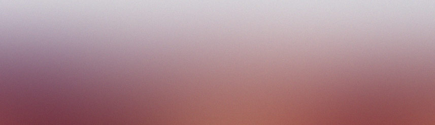

## ベリカード集

<header>
ベリカード集
</header>

今まで集めたベリカードのうち, 海外・短波局のものを紹介します.
短波放送は3.9MHz~26MHzで放送されている放送で, 昼夜問わず遠くまで電波が届くことが特徴です.
そのため, 海外向けの国際放送によく使われています.
国内だと海外向けのNHKワールド・ラジオ日本と
国内向けに競馬中継や市場概況を放送しているラジオ日経があります.

### 工事中

Comming soon!
